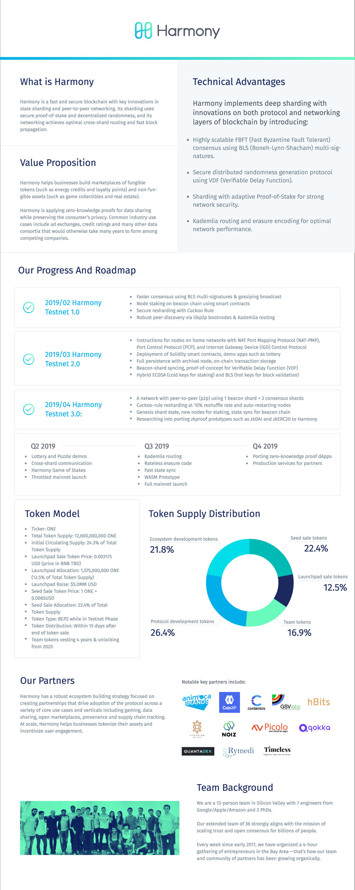

# Reference Material

* [Harmony Technical Whitepaper](https://harmony.one/whitepaper.pdf)
* [Harmony’s Staking and Incentive Design](https://github.com/harmony-one/nodes-wiki/tree/124a4fa71024022e8d5ecf62e7efcbb694665a79/docs/additional/https;/harmony.one/staking/README.md)
* [Harmony's medium articles](https://medium.com/harmony-one)
* [Harmony ONE on Binance](https://info.binance.com/en/research/ONE-2019-05-14.html)

## Harmony Overview

