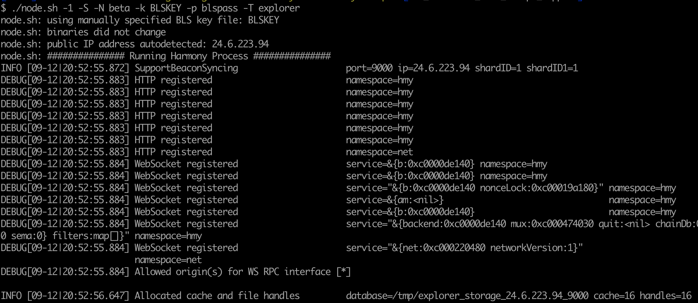

# Non-validating Nodes

Non-validating node is a full node of the blockchain with full history. It connects to the blockchain network using p2p networking. The non-validating node can be used by exchange or wallet website to broadcast transactions, to query balances, to fetch transaction data using RPC interfaces.

Harmony blockchain uses a node type called explorer node to satisfy the above requirements. Since Harmony is a sharding blockchain, it is currently required to setup one node per shard.

## Software Build

The current release branch is [s3](https://github.com/harmony-one/harmony/tree/s3) for mainnet. Please follow the readme file on the harmony repo to build the latest software release from s3 branch if you plan to build the software from scratch.

[https://github.com/harmony-one/harmony](https://github.com/harmony-one/harmony)

Or you may download the prebuilt node binary released by Harmony team.

## Installation

To setup node on public cloud, please try to follow this [document](https://nodes.harmony.one/foundational-node-playbook/setting-up-your-node/setupnode) for setup.

By default, the host needs to open up ports 6000, 9000, 9500, and 9800 for all the RPC and syncing functions. The default base port is 9000, all other ports are setup based on the base port.

* **9000** port is used for blockchain consensus messages. \(**The base port**\)
* 6000 port is used for blockchain state syncing. \(base port - 3000\)
* 9500 port is used for SDK RPC service \(base port + 500\)
* 9800 port is used for Websocket service \(base port + 800\)

The 9500, 9800 ports are only listened by localhost 127.0.0.1 by default. If it is required for the host to accept external links, the `-public_rpc` command line option can be specified to listen to public IP.

There is no need to have a valid BLS key for non-validating node as it won't join the consensus.

## Machine Spec.

Non-validating node is a full node of the blockchain except for not joining consensus. It is expected to have the node software running on an AWS m5.large equivalent host. The spec of m5.large can be found in this [document](https://aws.amazon.com/ec2/instance-types/m5/).

A node needs to sync both beacon chain and the shard chain data. It is expected to have 200Gb disk for 6-9 months data storage per shard.

It is possible to run multiple node software on one host with separated directory. However, it currently requires &gt;150G per shard of storage to run the node software and increasing ~25G per month per shard. Please plan your hard drive accordingly.

## Run the Node

The following steps assume the non-validating node connected to mainnet shard 0. The syncing of the mainnet blockchain DB will take quite some time. So, it is recommended to follow[ this guide](https://nodes.harmony.one/foundational-node-playbook/fast-state-syncing-using-db-snapshot) to use DB snapshot for initial syncing.

```text
# assuming setup the non-validator node on shard 0
export SHARD=0

# create shard directory
mkdir -p ~/shard${SHARD}
pushd ~/shard${SHARD}

# download node.sh
curl -L https://harmony.one/node2.sh > node.sh
chmod +x node.sh

# download harmony node binary
./node.sh -d
mv -f staging/* .

# check the version of the node binary
./node.sh -V

# create dummy key/pass files
touch BLSKEY
touch blspass

# download the db snapshot, this will take ~30 minutes
./node.sh -i ${SHARD} -b
mv -f db/harmony_db_${SHARD} .
rm -rf db

# start node in foreground if you are using tmux/screen session
# the base port is 9000 + 100 * $SHARD
./node.sh -S -k BLSKEY -p blspass -T explorer -i ${SHARD} -n $(( 9000 + 100 * $SHARD ))

# if you need to start node in background, which is needed for long
# running node process. You may use nohup or systemd
nohup ./node.sh -S -k BLSKEY -p blspass -T explorer -i ${SHARD} -n $(( 9000 + 100 * $SHARD )) &

# check if harmony process is running
ps -ef | grep harmony

# check the harmony node running log
tail latest/zerolog-*.log

# go back to previous directory
popd
```

The expected output is like the following if it is running in the foreground.



### Setup non-validating node for other shard, ex shard 1

Use a different base port if it is running on the same server

```text
export SHARD=1

# please follow the commands in the previous section to start
# noted the node will be running on a different base port
```

## Run the node in background

To have a long running node in the background on the host, you may either use [tmux](https://github.com/tmux/tmux) or use [systemd servcie](http://man7.org/linux/man-pages/man5/systemd.service.5.html). A sample of the systemd service configuration is like the following:

```text
[Unit]
Description=harmony service
After=network.target
StartLimitIntervalSec=0

[Service]
Type=simple
Restart=always
RestartSec=1
User=ec2-user
WorkingDirectory=/home/ec2-user
ExecStart=/home/ec2-user/node.sh -1 -S -i 0 -p /home/ec2-user/blspass -k /home/ec2-user/BLSKEY -T explorer

[Install]
WantedBy=multi-user.target
```

