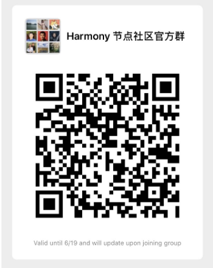

# Setting up your node

**Welcome and thank you for participating in the genesis of Harmony’s network!**

This is a guide for setting up your Foundational Node to participate in Harmony Mainnet v0 up until mainnet v1. By participating as a foundational node operator, you will claim block rewards that will convert into real ONE tokens upon launch of mainnet v1.

Please keep in mind that the network is likely to be unstable and we may experience halts or other forms of failure requiring intervention. This is expected while the network gains stability. We really appreciate your patience during this time.

The primary goal of Mainnet v0 is to demonstrate a production-level stable network that tests our consensus. Soon after achieving stability, we will test out our PoS through a Game of Stakes type competition. This will help us test various attack vectors and various economic and technical parameters in our PoS implementation.

**Community Channels**

Most coordination will happen via our foundational node Discord channel. Please join so that you can stay up to date. Our team will be available to help walk you through the process should you run into any issues following this guide.

1. Discord - [https://harmony.one/discord](https://harmony.one/discord) a. Once you have joined our discord channel, send a message to “@Li \| Harmony.one\#7220” to add you to the private “foundational-node” channel.
2. Telegram - [https://t.me/joinchat/HZniehM2XxaokN1QbglsaQ](https://t.me/joinchat/HZniehM2XxaokN1QbglsaQ) a. If you prefer Telegram join our foundational node channel at the link above.
3. WeChat - a. If you prefer WeChat, scan this QR code. If the code has expired, notify Li \(li@harmony.one\)

