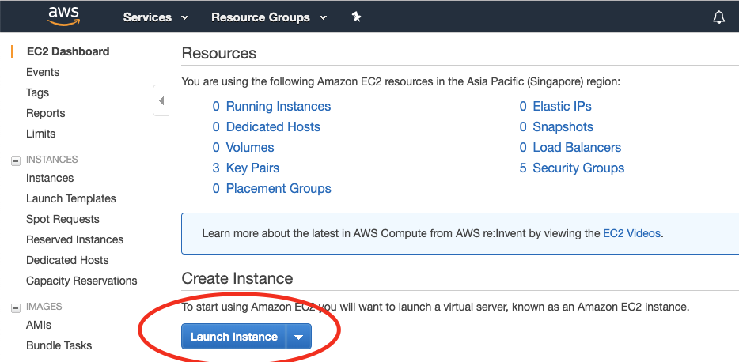
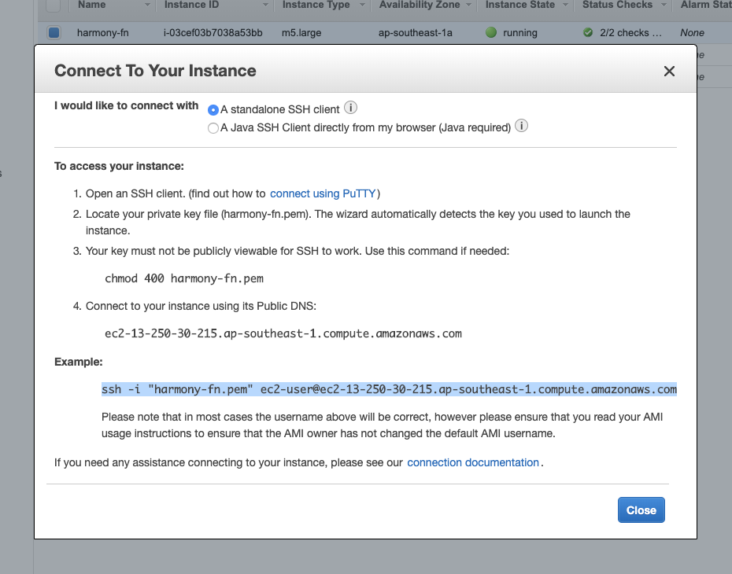

# AWS Setup

## **Setting up your node on AWS**

This will walk you through the steps to launch your cloud instance on AWS. Then it will take you through the process of downloading and installing the Harmony node software and generating an address for you to participate in the network. You can watch a video walk through of the first two steps at [https://harmony.one/fn-video](https://harmony.one/fn-video) and [https://youtu.be/AWnkXGGwhIo](https://youtu.be/AWnkXGGwhIo).

**Launching your AWS instance**

If you don’t already have an AWS account, register one at [https://aws.amazon.com](https://aws.amazon.com).

Log into your AWS account

Click on the top left bar “Services -&gt; Compute -&gt; EC2”


Click on the blue button “Launch Instance”



Select “Amazon Linux 2 AMI \(HVM\), SSD Volume Type”


Choose instance type “t3.small” \(you will have to scroll down to see it\)


Click “Next: Configure Instance Details” at the bottom right of the page

Nothing to change here, so click “Next: Add Storage”

Change the “Size \(GiB\)” category to 150

Click “Next: Add Tags"

In the “Key” input box put “Name” in “Value” put “harmony-fn”


Click “Next: Configure Security Group”

On the default SSH with port 22, change the “Source” option to “Anywhere”

Now you will need to add the following 2 ports: 6000, 9000. To add each of them, click “Add Rule”, under type select “Custom TCP Rule”, under “Port Range” put the port number, for “Source” select “Anywhere”. Repeat the process until you’ve added all the ports.


Click “Review and Launch”

Ignore warnings such as “your security group is open to the world” or “your instance configuration is not eligible for free tier”

Click “Launch”. See Troubleshooting below if you are getting an error.

In the pop-up window you will need to create a new key pair. Select “Create a new key pair” and then enter a name that you like, for example “harmony-fn”


Click “Download Key Pair”

Click “Launch Instances”

Click “View Instances”. Your new instance should be initializing, wait a few moments for it to get started.


Keep this window open for future reference

**Connecting to your AWS instance and generating your keys**

Open a Terminal window on your computer. If you can’t find Terminal, search for it in your applications folder. \(If you are on a mac, they often hide Terminal inside of the “Utilities” folder within Applications.\)


If you are on windows, download PuTTY or Git Bash to allow your computer to SSH into the AWS instance. For instructions on connecting to an EC2 instance using PuTTY follow the following resource from Amazon: [https://docs.aws.amazon.com/quickstarts/latest/vmlaunch/step-2-connect-to-instance.html](https://docs.aws.amazon.com/quickstarts/latest/vmlaunch/step-2-connect-to-instance.html)

Once Terminal is open, use the “cd” command to change your directory to where the key pair file \(ex: harmony-fn.pem\) that you generated is. \(Hint: it may be in your “Downloads” folder.\)


Enter the command “chmod 400 harmony-fn.pem” \(this makes your key not publicly viewable\).


Go back to your AWS window where you are viewing your instances, select your new instance \(it should be named “harmony-fn”\) and click “Connect” on the top bar

In the pop-up window, under the “Example:” header, copy the sample command to connect to your ec2 instance. The command will look something like:

```text
 ssh -i "harmony-fn.pem" ec2-user@ec2-13-250-30-215.ap-southeast-1.compute.amazonaws.com
```



Now connect to your instance by running the sample command you copied from the “Connect” page in your terminal window.


It may ask you whether or not you want to continue connecting. Type in “yes” and hit enter.

Congratulations! You should be logged into your new AWS instance! If you need further instructions, you can find more information here: [https://harmony.one/nodes](https://harmony.one/nodes)

Run the following command to make sure your instance is properly updated:

```text
 sudo yum update
```

Make a new directory to store your Harmony keys with the following command:

```text
mkdir -p ~/.hmy/keystore
```

Now execute the following commands to download the wallet software and allow it to be executed:

```text
curl -LO https://harmony.one/wallet.sh
chmod u+x wallet.sh
./wallet.sh -d
```

Create a new ECDSA account address with the following command and input your passphrase:

```text
./wallet.sh new
```


Create a BLS key pair with the following command \(private key hidden in image\):

```text
./wallet.sh blsgen
```


You should have created an ECDSA account address starting with “one”. Send this account address to genesis@harmony.one, together with your discord handle with \#number suffix, \(i.e. “@Eugene Kim \| Harmony\#9608”\), also include your BLS public key from the previous step. Please use the subject line “mainnet”.


Almost there! Now that we have your public key, we will include you as a validator in our genesis block. To verify if your account address is included in the genesis block check the following link:

[https://raw.githubusercontent.com/harmony-one/harmony/master/internal/genesis/foundational.go](https://raw.githubusercontent.com/harmony-one/harmony/master/internal/genesis/foundational.go).

Be patient as this will take time before it is updated.

### Stopping Your Instance to Prevent AWS Billing

Before you are added to Harmony Mainnet you can stop your instance so that you are not billed by AWS while waiting to join Mainnet.

To do this go to your instance

Select "Actions"

Select "Instance State"

Select "Stop"


Once added to Harmony Mainnet, start your instance again by selecting "Start."

**Connecting your node to Harmony network**

Once you’ve submitted your keys to the Harmony Team and they have been added, wait for the rolling upgrade, then you will be able to connect your node. Otherwise you will not have permission to participate since your address won’t be recognized.

If you have satisfied the above, install tmux using the following command:

```text
 sudo yum install -y tmux
```


Create a virtual terminal session in tmux. \(This will hide all of your past entries to the command line.\)

```text
 tmux new-session -s node
```


Fetch the node script from our Github:

```text
 curl -LO https://harmony.one/node.sh
```

Change the permission of the script:

```text
 chmod u+x node.sh
```

If your account account appears in the list, you will be able to join the testnet when it is launched. Run the following command to connect your node:

```text
 sudo ./node.sh
```


If you are joining after the network has been up for a while, it will take some time for you to sync to the latest block. Be patient and keep an eye out for a message that says “BINGO !!! Reached Consensus”

Since our mainnet has been launched for a few months, the blockchain DB is huge right now. It may take a few days for your node to sync to the latest blockchain before the node can join the consensus. So, it is recommended to use database snapshot to catch up with the latest db by downloading a db snapshot tarball. Please check the following document on how to download the database snapshot.  
[https://nodes.harmony.one/foundational-node-playbook/fast-state-syncing-using-db-snapshot](https://nodes.harmony.one/foundational-node-playbook/fast-state-syncing-using-db-snapshot)

Next, exit tmux from the command line in order to check your balance: First hit “**Ctrl+b**” then "**d**"

* Pressing **Ctrl+b** allows you to enter some of tmux’s commands. \(**Command+b** for mac\)
* **d** is the tmux command for detach, returning you to the terminal before starting tmux. Press **d** after releasing **ctrl+b**, not at the same time.


In the case you need to go back to the previous exited session, use the following command:

```text
 tmux attach
```

Now we will check the functionality to ensure you are connected:

```text
grep BINGO latest/zerolog*.log
```

These take time to generate, repeat this command to see how times your node helped to reach consensus.


Now let’s check the balance of your account to make sure you are receiving block rewards. Enter the following command:

```text
./wallet.sh balances
```


## Tips/FAQ/Troubleshooting

1. AWS EC2 is used in this example, though there are few limitations If you are more comfortable using a different cloud computing service which allows access to Linux 2, and the correct ports are open, with a sufficient amount of processing power, there are no set limitations in doing so. Some examples are Microsoft’s Azure, Google Cloud Platform, IBM Bluemix, and Alibaba Cloud should all function for the purposes of running a node.
2. For better security it’s recommended to always access AWS through IAM user accounts and to set up MFA \(multi-factor authentication\) on both root and IAM user accounts. [https://docs.aws.amazon.com/IAM/latest/UserGuide/getting-started\_create-admin-group.html](https://docs.aws.amazon.com/IAM/latest/UserGuide/getting-started_create-admin-group.html)
3. You can get circa 33% discount by purchasing a reserved instance with no upfront cost. If you have a new AWS account, it _might_ require opening a support ticket to raise the limit for no upfront reserved instances. Also you might need to have at least one month of a successful billing history on AWS account to be able to purchase with no upfront.
4. If when your .pem key is generated it includes the extension .pem.txt, change the command given in the “Connect” example to match the file name exactly. Ex:

   ```text
    ssh -i "harmomy-fn.pem.txt" ec2-user@ec2-18-139-83-3.ap-southeast-1.compute.amazonaws.com
   ```

5. Generation of BLS keys is independent of your harmony “one” address
6. If you are receiving an error message after attempting to launch the EC2 instance, it may be because your account is new. If this is the case, wait for a couple of minutes for Amazon to verify your account and try again. EX:


1. Can I run multiple nodes on the same VM \(EC2 instance\)? Yes, you can create a new tmux using a different name than the one created in the example provided \(node\). From here you can start another node with a second address.
2. Does running another node on the same VM \(EC2 instance\) reduce my costs? This is a question that we are currently answering. This question also brings into account an added risk of having all of your nodes running on a single point of failure.
3. The line

   ```text
    curl -LO https://harmony.one/node.sh
   ```

   is giving me an error.

   Try running this line again after a couple of minutes and the issue should be fixed.

4. When I try to SSH into my EC2 instance, I am getting an error message:

   To solve this issue, make sure that you “cd “ into the folder holding your pem file, and type in the following command:

   ```text
   chmod 400 /Users/myself/Documents/MyAccessKey1.pem
   ```

   Change the directory to be that of your saved .pem file. This changes the access to this file so it is more private and can be securely used as a key.


1. After running “sudo ./node.sh ACCOUNT\_ADDRESS” if you are getting error message account ID not found, that means that your account ID hasn’t yet been synced with our system. After your Discord and Email accounts have been verified through our emailing process with genesis@harmony.one, you should be able to access your account using this line.

