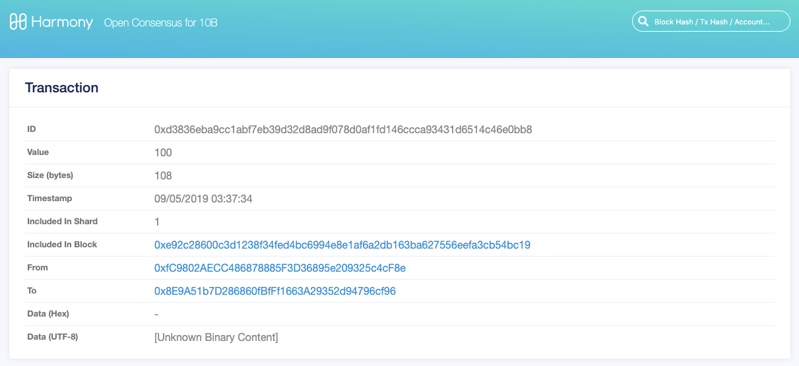

# Token Transfers on Mainnet

## Getting Super Powers

For Foundational Node operators and Pangaean node operators:

First, connect to your node and make sure you update your wallet.

```text
./wallet.sh -d
```

Here is the generic example of commands to do a transfer:

```text
./wallet.sh transfer --from one1... --to one1... 
--amount # --shardID # --pass pass:YOURPASSPHRASE
```

And here is a very specific example of a transfer:

```text
./wallet.sh transfer --from one1ljvq9tkvfp583zzl85mgjh3qjvjufnuwmn7krv 
--to one136d9rd7js6rql0llze369y6jm9rednukz6ukhc --amount 100 --shardID 1 
--pass file:pass.txt
```

Notice that in the specific example the PASSPHRASE is embedded in a text file called:

```text
pass.text
```

To put your pass phrase into a text file called pass.txt, run the following command first before you run the transfer command:

```text
echo -n "YOURPASSPHRASE" > pass.txt
```

You must specify the shardID and put the shard number in which you have tokens for the transfer to work.

```text
--shardID 1
```

We suggest you try out token transfer with another foundational node member or Pangaean. Be careful with your newfound powers. When you are done, you can search for the transaction hash on [explorer.harmony.one](https://explorer.harmony.one).

These are the basic steps for now. We are looking for your support and will keep this guide up-to-date as we get feedback from our foundational nodes and Pangaea community. Enjoy responsibly.

**This is what a successful transaction looks like:**

```text
./wallet.sh transfer --from one1ljvq9tkvfp583zzl85mgjh3qjvjufnuwmn7krv 
--to one136d9rd7js6rql0llze369y6jm9rednukz6ukhc --amount 100 --shardID 1 
--pass file:pass.txt
Using default profile for wallet
Unlock account succeeded! 'file:pass.txt'
Transaction Id for shard 1: 
0xd3836eba9cc1abf7eb39d32d8ad9f078d0af1fd146ccca93431d6514c46e0bb8
```

And here is that transaction on our explorer: [https://explorer.harmony.one/\#/tx/0xd3836eba9cc1abf7eb39d32d8ad9f078d0af1fd146ccca93431d6514c46e0bb8](https://explorer.harmony.one/#/tx/0xd3836eba9cc1abf7eb39d32d8ad9f078d0af1fd146ccca93431d6514c46e0bb8)

And the screenshot, just for good measure :\)



**Creating a new wallet address**

```text
./wallet.sh new 
Passphrase: 
Passphrase again: 
account: one19czwam2ukyfr5ucz36zsnvezd78u2d5dcx4t2z
```

