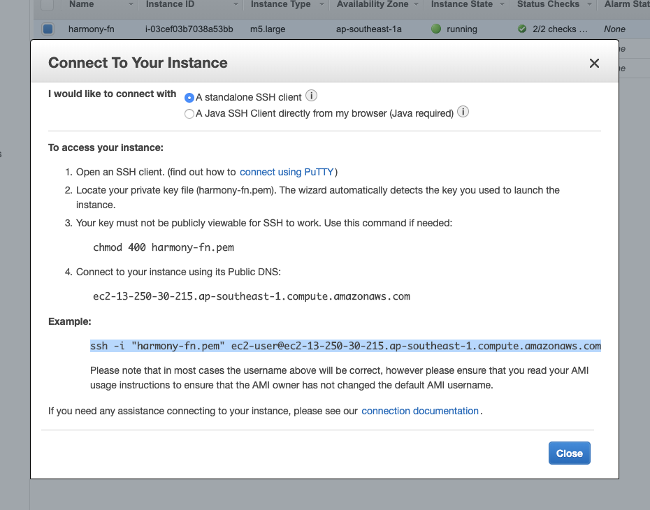
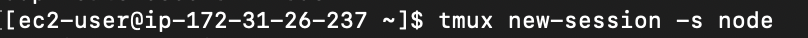
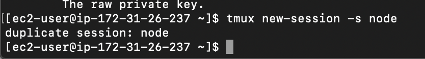
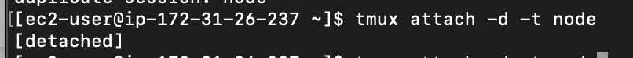

# Node operator mainnet launch prep


Before you go through this make sure to follow up with our key management guide in order to prevent any mistakes or key loss


Here are the following commands you should use to relaunch:

Open terminal/git bas/PuTTY.

Connect to your instance, using ssh \(check your aws ec2 instance for exact command\).



Download the latest version of the wallet script in your terminal.

```text
curl -LO https://harmony.one/wallet.sh
chmod a+x wallet.sh
./wallet.sh -d
./wallet.sh list
```

Enter "**tmux new-session -s node**" to make a new tmux session named "node".



If you already have tmux up and running, you will receive the "**duplicate session**" error. To avoid this use "**tmux attach -d -t node**" as shown below:





Copy and paste the following commands one at a time:

```text
curl -LO https://harmony.one/node.sh
chmod a+x node.sh
sudo ./node.sh -c
```

Press ctrl+b then hit "d" to detach from tmux

Check your wallet balances using:

```text
./wallet.sh balances
```

