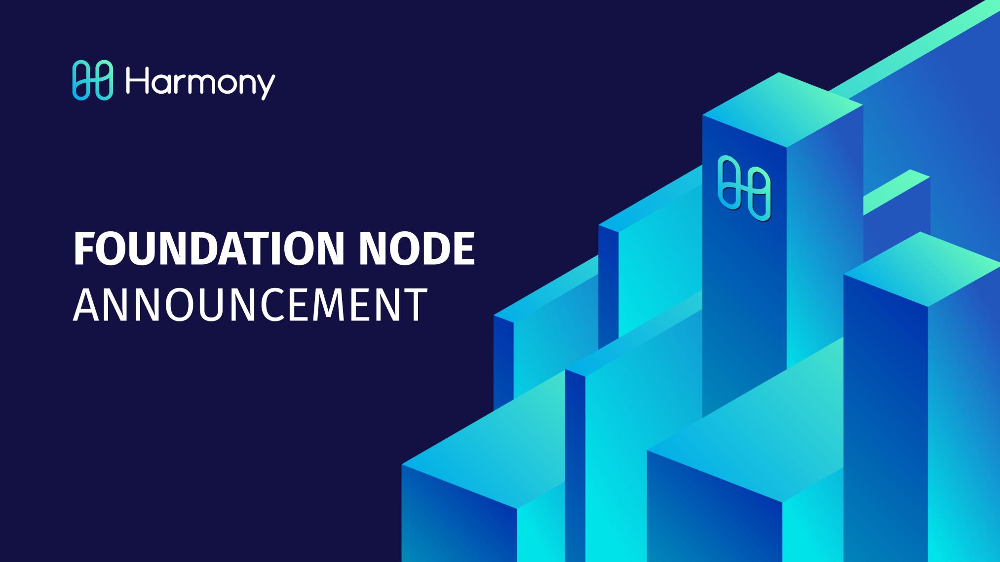

# Monitoring and Reporting Tools

**Reporting and Monitoring Tools**

* Block Explorer
  * [Harmony Explorer](https://explorer.harmony.one/)
* Status Overview \(Internal Nodes\)
  * [Harmony Status](https://status.harmony.one/)
* Rewards Overview \(FN Nodes\)
  * [Foundational Node Reward Rate - 1 hour](https://harmony.one/1h)

