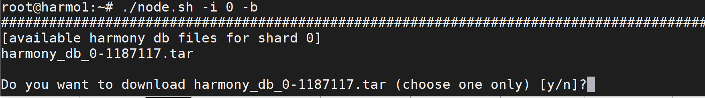

# Using DB Snapshot

This guide is about how to use the Harmony DB snapshots to quickly sync up to a recent database. This is a centralized solution to provide fast state syncing. It can be used to quickly recover a validator node. After the snapshot sync-up, the decentralized state syncing solution will be used going forward.

The following guidance assumes you wish to use a Harmony DB Snapshot to catch up with the beacon chain syncing. A similar process can be applicable to recover your node in other shards.

Noted, we are a sharded blockchain. The shard0 is the beacon chain. All the validator nodes in other shards, like 1, 2, 3, need two blockchain data. One is the beacon chain \(shard0\) and the other is their own shards.

## Download node.sh

You can now use node.sh in order to download a db snapshot before starting your validator. This will help your validator sync much faster with the latest blockchain state.

```text
curl -LO https://harmony.one/node.sh
chmod a+x node.sh
./node.sh -h
```


To download the harmony db snapshot for shard 0. You need at least 50G of free disk space. We recommend at least 150G total disk space for all validators as of November, 2019. The disk usage may increase over time.


## Check Block Height

Please check your block height on beacon chain \(shard 0\).

```text
tac latest/zerolog*.log | grep -m 1 blockShard.:0 | grep -oE blockNumber.:[0-9]+
```

You may also check the block height on your own shard \(shard 1, 2, or 3\), please replace **X** with your own shard number.

```text
tac latest/zerolog*.log | grep -m 1 blockShard.:X | grep -oE blockNumber.:[0-9]+
```

You may check [https://harmony.one/1h](https://harmony.one/1h) page to find the latest block height on each shard. If your beacon chain block height is less than 1,187,117, you may use the pre-created DB snapshot to catch up faster on the beacon chain.

For a new validator node, you may also need to use the prebuilt database snapshot to fast sync your DB on your own shard.

## Download and extract DB Snapshot

Use node.sh to download and extract DB snapshot for DB 0 and if necessary DB x, where x can be 1, 2 or 3. So there are two cases:  
1\) If your validator is on shard 0 then you need to **download and extract** **only DB 0**.  
2\) If your validator is for example on shard 2, then you need to **download and extract DB 0 and DB 2;**

**Note:** -i option in node.sh is used to specify the shard number. You may choose different shard number, eg. 0, 1, 2, 3, if you need to quickly recover nodes for a different shard. Again, every validator needs to sync both beacon chain \(shard0\) and in case the validator is on another shard different than beacon chain, then also their own shard \(shard1, 2, 3\).

```text
./node.sh -h

# sync beacon chain
./node.sh -i 0 -b

# sync your own shard, replace X with your shard number.
# This is needed for new node.
./node.sh -i X -b
```



Choose `y` to download and extract the `harmony_db_0/` directory into the `db/` directory.

**Noted:** 1187117 in the suffix of the filename \(`harmony_db_0-1187117.tar`\) indicates the block height of this tarball file. We may upload newer version of the tarball with higher block height every week. Always choose the latest tarball to catch up with the latest blockchain faster.

### **Update 11/10.**

_1187117_ is the latest block height for shard0 db snapshot.

_1107116_ is the latest block height for shard1 db snapshot.

_1146627_ is the latest block height for shard2 db snapshot.

_1129378_ is the latest block height for shard3 db snapshot.


Note : **This is downloading the DB snapshot file** which is very large and may take up to an hour depending on your network connectivity. **This is not running a node**. After this process is complete you then need to switch the DB as per instructions below.


## Switch to the DB Snapshot

You need to stop the current harmony process before switch to using the new Harmony DB Snapshot.


If you are running node.sh in tmux, please attach to your tmux session and use ctrl+c to terminate the node.sh.


Or you may just kill the process from the terminal. \(For example\)

```text
sudo pkill harmony
sudo pkill node.sh
```

Make sure no harmony process is running in the system, you can run the following command to expect nothing returned.

```text
pgrep harmony
```

Then you can use the new DB snapshot to replace your old beacon chain DB. Afterwards, if your validator is on shard 1, 2 or 3 you have to also download the DB snapshot for that respective shard. First of all, you need to change the current directory where you start the harmony node program, normally it is in your home directory.

```text
cd
sudo mv -f harmony_db_0 harmony_db_0.backup
sudo mv -f db/harmony_db_0 .

# run also the commands below if your node is on shard 1, 2 or 3 and replace x with your shard id
sudo mv -f harmony_db_x harmony_db_x.backup
sudo mv -f db/harmony_db_x .
```

Now you can restart your Harmony node program using node.sh. Using the command in "Check Block Height" session, you should see the block height of beacon chain increase from 1187117.  
**In your tmux session:**

```text
sudo ./node.sh
```

Press **Ctrl+b then hit "d"** to detach from tmux.

Outside your tmux session you can check to see your shard is incrementing. **Note:** replace the _**x**_ in `blockShard.:X` with the shard your validator is on. This means _**x**_ can be 0, 1, 2 or 3.

```text
tac latest/zerolog*.log | grep -m 1 blockShard.:1 | grep -oE blockNumber.:[0-9]+
```

After the node resumes , please remove the tarball and the db backup.

```text
rm -rf db
rm -rf harmony_db_0.backup

# run also the command below if your node is on shard 1, 2 or 3 and replace x with your shard id
rm -rf harmony_db_x.backup
```

