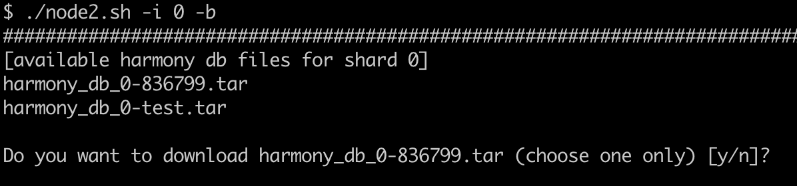

# 使用数据库快照进行快速状态同步

本文将介绍如何使用Harmony数据库快照快速将你的节点同步到最近的区块链数据库状态。这是一种提供快速状态同步的中心化解决方案。它可用于快速恢复验证类型节点。去中心化的数据同步将会之后被使用。

下文基于您希望使用Harmony数据库快照来与信标链同步的场景。类似的，你也可以在简单改动命令参数后用于在其他分片中恢复节点。每一个分片节点都需要同步信标链和本分片的数据。另外，分片0就是信标链。

**第一步:下载node2.sh文件**

这是一个当前的临时步骤，因为通过数据库快照同步的功能将在下一个版本的node.sh发布。

```bash
$ curl -LO https://harmony.one/node2.sh
$ chmod +x node2.sh
$ ./node2.sh -h
```

> 注意:若要下载分片0的Harmony数据库快照，您至少需要提前预留50G的可用磁盘空间。

**第二步:检查区块高度**

请先检查当前信标链（分片0\)上的区块高度。

```bash
# 请使用blockShard.:X替换blockShard.:0，其中X是您的节点所在的分片
$ tac latest/zerolog*.log | grep -m 1 blockShard.:0 | grep -oE blockNumber.:[0-9]+
```

您可以点击链接:[https://harmony.one/1h](https://harmony.one/1h)查看当前每个分片的最新区块高度。如果你自己的数据里的分片0区块高度小于836799，则可以通过后续步骤，使用数据库快照与信标链更快地同步。

**第三步:下载并解压缩数据库快照**

请注意:执行node2.sh中的 -i 参数用于指定分片编号。如果需要快速恢复其他分片节点，您可以选择自己节点所在的分片编号，例如: 1,2,3。注意，分片0就是信标链，每个其他分片除了自己的分片以外，还都需要同步分片0的数据。

```bash
# 同步信标链
$ ./node2.sh -h
$ ./node2.sh -i 0 -b

# 如果你的分片是1，请使用您的节点所在的分片编号1
$ ./node2.sh -h
$ ./node2.sh -i 1 -b
```

执行命令后如下图所示:



输入 y 确认下载并将 harmony\_db\_X/ \(X为您的节点所在的分片编号\)目录解压缩到 db/ 目录中。

> 注意: 1. 上例中的836799在文件名（harmony\_db\_0-836799.tar）仅表示制作此使用指南时的区块高度。我们随时可能会上传具有更高区块高度的数据库快照压缩包。请选择最新的数据库快照文件。 2. 该步骤**仅下载和展开数据库快照文件**，该文件非常大，根据您的节点网络环境，可能需要一小时左右的下载时间\(处于中国大陆网络的节点可能需要更多的时间\)。下载完成后**不会自动切换数据库并启动节点**，需要您需要按照后续步骤切换数据库。

**第四步:切换到数据库快照**

在切换到新的Harmony数据库快照之前，您需要停止当前的Harmony节点进程。

> 注意:如果您在tmux中运行node.sh，请进入\(attach\)到您的tmux会话并使用ctrl-c终止node.sh.

或者您可以使用下列命令直接从终端终止Harmony节点进程

```bash
$ sudo pkill harmony
$ sudo pkill node.sh
```

若要确认系统中是否没有运行Harmony节点进程，您可以运行以下命令，若不返回任何内容则表示Harmony节点进程未在运行。

```bash
$ pgrep harmony
```

然后，您可以使用新的数据库快照替换旧的信标链数据库。首先，您需要进去存放启动Harmony节点程序的目录\(即node.sh的所在目录\)，通常它位于您的家目录\(服务器登录后首先进入的目录\)。

```bash
# 请使用harmony_db_X替换harmony_db_0，其中X是您的节点所在的分片
$ cd
$ sudo mv -f harmony_db_0 harmony_db_0.backup
$ sudo mv -f db/harmony_db_0 .
```

现在，您可以在您的tmux会话中，使用node.sh重新启动Harmony节点程序。使用帮助手册“Check Block Height”章节中提供的命令，您应该看到信标链的区块高度从836799增加。

```bash
$ sudo ./node.sh
<CTL>b d
```

在脱离\(detached\)您的tmux会话后，您可以通过下列命令查看您节点的同步区块高度是否正在递增

```bash
# 查看信标链的区块高度
$ tac latest/zerolog*.log | grep -m 1 blockShard.:0 | grep -oE blockNumber.:[0-9]+

# 请使用blockShard.:X替换blockShard.:1，其中X是您的节点所在的分片
$ tac latest/zerolog*.log | grep -m 1 blockShard.:1 | grep -oE blockNumber.:[0-9]+
```

最后，在验证节点恢复收益后，即可删除压缩包解压后的目录与原数据库的备份文件。

```bash
# 请使用harmony_db_X替换harmony_db_0，其中X是您的节点所在的分片
$ rm -rf db
$ rm -rf harmony_db_0.backup
```

