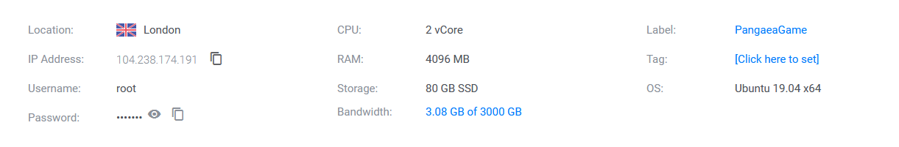

# Google Cloud Setup

## **Setting up your node on Google Cloud**

This will walk you through the steps to launch your cloud instance on Google Cloud. Then it will take you through the process of downloading and installing the Harmony node software and generating an address for you to participate in the network.

## Step 1: Launching your Google Cloud Instance <a id="step-1-launching-your-google-cloud-instance"></a>

Go to [ https://cloud.google.com](../../) and click on “Get Started for Free” if you don’t have an account yet or on “Sign in” if you already have a Google Account. If you haven’t used Google Cloud yet, you will get a $300 USD dollars credit for 1 year!

After you login and validate your credit card, you will be shown a page pretty much like this one. Click on “Compute Engine” and then in “VM Instances”.


Click on the Create button to make a new instance



We recommend to name it something like "HarmonyFoundation” \(the instance name cannot be changed\). Select the Machine type as “Custom” and set up 2 vCPU’s and 4GB of Memory.


For Pangaea, keep everything default after you have configured the cores and memory. Foundation node will need to change the disk size from 10 GB to 150 GB. Click on the change button on the boot disk section.


Click Create. Please wait a few minutes for your instance

Once the instance is created. We will open 4 ingoing ports. To do this click on "nic0" as shown below. In the next page click on “Firewall rules” and after that on “CREATE FIREWALL RULE”.


* TCP 6000
* TCP 9000


Now go back to the VM instances page and click on SSH. This will open a new window and connect via SSH to your instance.


## **Step 2: Connecting to your Google Cloud Instance and generating keys** <a id="step-2-connecting-to-your-google-cloud-instance-and-copying-keys"></a>

You will be thrown to the ssh session with your default user. We will have to first make a password for yourself to change to root user. To do so, enter in

```text
sudo passwd
```

Once you have done that, to enter into root mode enter in

```text
su
```

This command will then ask you for your password from the step above. When entered correctly it will show you as root user.


Before anything is recommended to update your system

```text
apt update && apt upgrade
```

Now install the following packages that will be needed to run Harmony by typing:

```text
apt-get install dnsutils
apt-get install tmux
```

You will be asked to confirm if you would like to download and install these packages. Just press Y to confirm.

Make a new directory to store your Harmony keys with the following command

```text
mkdir -p ~/.hmy/keystore
```

Now type in the following commands

```text
curl -LO https://harmony.one/wallet.sh
chmod u+x wallet.sh
./wallet.sh -d
```

Create a new ECDSA account address with the following command and input your passphrase:

```text
./wallet.sh new
```


Create a BLS key pair with the following command \(private key hidden in image\):

```text
./wallet.sh blsgen
```


Please keep your BLS private key with you! Do not move past this part until you have it saved somewhere safe with the passphrase.

You should have created an ECDSA account address starting with “one”. Send this account address to genesis@harmony.one, together with your discord handle with \#number suffix, \(i.e. “@Eugene Kim \| Harmony\#9608”\), also include your BLS public key from the previous step. Please use the subject line “mainnet”.


Almost there! Now that we have your public key, we will include you as a validator in our genesis block. To verify if your account address is included in the genesis block check the following link:

[https://raw.githubusercontent.com/harmony-one/harmony/master/internal/genesis/foundational.go](https://raw.githubusercontent.com/harmony-one/harmony/master/internal/genesis/foundational.go).

Be patient as this will take time before it is updated.

## Step 3: Launching your Node

Once you’ve submitted your keys to the Harmony Team and they have been added, wait for the rolling upgrade, then you will be able to connect your node. Otherwise you will not have permission to participate since your address won’t be recognized

Create a virtual terminal session in tmux. \(This will hide all of your past entries to the command line

```text
 tmux new-session -s node
```


Fetch the node script from our Github:

```text
 curl -LO https://harmony.one/node.sh
```

Change the permission of the script:

```text
 chmod u+x node.sh
```

If your account account appears in the list, you will be able to join the testnet when it is launched. Run the following command to connect your node:

```text
 sudo ./node.sh
```


If you are joining after the network has been up for a while, it will take some time for you to sync to the latest block. Be patient and keep an eye out for a message that says “BINGO !!! Reached Consensus”

Next, exit tmux from the command line in order to check your balance: First hit “Ctrl+b” then "d"

* Pressing Ctrl+b allows you to enter some of tmux’s commands. \(Command+b for mac\)
* d is the tmux command for detach, returning you to the terminal before starting tmux. Press d after releasing ctrl+b, not at the same time.


In the case you need to go back to the previous exited session, use the following command:

```text
 tmux attach
```

Now we will check the functionality to ensure you are connected:

```text
grep BINGO latest/zerolog*.log
```

These take time to generate, repeat this command to see how times your node helped to reach consensus.


Now let’s check the balance of your account to make sure you are receiving block rewards. Enter the following command:

```text
./wallet.sh balances
```


