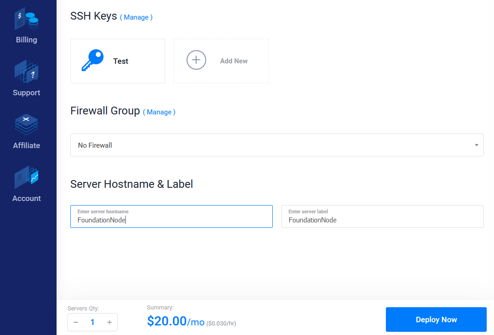
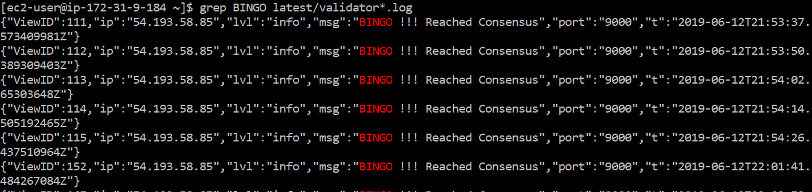

# Vultr Setup

## **Setting up your node on Vultr**

This will walk you through the steps to launch your cloud instance on Vultr. Then it will take you through the process of downloading and installing the Harmony node software and generating an address for you to participate in the network.

## **Step 1: Launching your Vultr instance** <a id="step-1-launching-your-vultr-instance"></a>

If you don’t already have an Vultr account, register one by clicking on “Sign up”.

Log into your Vultr Account by clicking on “Sign in”


Select the instance type.  
For Foundation Node, the requirements are at least 2 CPU's and 4 GB of Memory, and 1TB of Bandwidth

### Create a new instance <a id="create-a-new-instance"></a>

Once logged in, you'll want to add a new instance.  
Depending on whether your account is new or not, you may or may not have a Products page.

* If you already have an instance, click the "+" button to deploy a new server. You can also use this [link](https://my.vultr.com/deploy/) to go to the deploy page.
* Otherwise, your Products page will be already link you to the Deploy page.


### Choose Instance Type <a id="choose-instance-type"></a>

**High Frequency** is recommended for Foundational Nodes as it is the cheapest you can get considering the storage size needed to run Harmony.


### Select Server Location and Server Type <a id="select-server-location-and-server-type"></a>

You can choose your preferred location as well as server type.  
Ubuntu 18.04 x64 or Debian 9 x64 have been tested to work very well.


### Choose Server Size <a id="choose-server-size"></a>

Harmony recommends the following instance if your node **is not** on Shard 0. Please go to "**Note**" just right at the end of this section if your node is on Shard 0.

**High Frequency Instance**

* 3 CPU, 8 GB RAM, 256 GB NVMe SSD

For "Additional Features", none of the selections are necessary.


**Note:** If you are on Shard 0 you can choose a cheaper option for now as the beacon chain doesn't require too much storage requirements yet. Choose one of the following instances:

**High Frequency Instance**

* 2 CPU, 4 GB RAM, 128 GB NVMe SSD

**Compute Instance**

* 4 CPU, 8 GB RAM, 160 GB NVMe SSD

### Setting Server Name <a id="setting-server-name"></a>

You can now set the name of your server, e.g. FoundationNode  
Then you should click "Deploy Now".



At this point you should be back on the Products page and your server should be installing.  
However, the setup isn't completely done, as you need to still create a firewall.


### Create Firewall Group <a id="create-firewall-group"></a>

As we want to allow other nodes to connect to yours, we have to open the correct ports.

Once you are on the [Firewall page](https://my.vultr.com/firewall/), click Add Firewall Group.


Enter a name for the firewall group, e.g. FoundationNode.

### Set Firewall Rules <a id="set-firewall-rules"></a>

#### Open the following 3 ports to the public \("Anywhere" on inbound\). <a id="open-the-following-5-ports-to-the-public-anywhere-on-inbound"></a>

* TCP 22 \(SSH\)
* TCP 6000
* TCP 9000

Make sure to check that 3 Group Rules have been set.


#### Then link the instance to the firewall group. The steps are as follows: <a id="then-link-the-instance-to-the-firewall-group-the-steps-are-as-follows"></a>

1. Click Linked Instances.
2. Make sure your new server is selected.
3. Click the + button.
4. Click Add Linked Instance.


Your instance should now be added to the firewall group and the number of linked instances should increment by 1.


You can now go back to the Products page and your server is now successfully set up!


## **Step 2: Connecting to Your Vultr Node** <a id="step-2-connecting-to-your-vultr-node"></a>

**Connect to your Vultr Instance by using Git Bash.**

If you do not have gitbash installed. Please visit this [link to install](https://gitforwindows.org/). Everything can be default selection when you are installing.

In your Vultr instance console overview. You will see your instance information. To go into your instance from git bash. We will use the command:

```text
ssh root@<INSTANCEIPADDRESS>
```


It will the prompt you for a password. The password is unique to each instance. To find your password. Look at the Vultr Console website. There is a unique password that is associated with your instance. Copy and paste that in.


Before anything is recommended to update your system

```text
apt update && apt upgrade
```

Make a new directory to store your Harmony keys with the following command

```text
mkdir -p ~/.hmy/keystore
```

Now type in the following commands

```text
curl -LO https://harmony.one/wallet.sh
chmod +x wallet.sh
./wallet.sh -d
```

Create a new ECDSA account address with the following command and input your passphrase:

```text
./wallet.sh new
```


Create a BLS key pair with the following command \(private key hidden in image\):

```text
./wallet.sh blsgen
```


Please keep your BLS private key with you! Do not move past this part until you have it saved somewhere safe with the passphrase.

You should have created an ECDSA account address starting with “one”. Send this account address to genesis@harmony.one, together with your discord handle with \#number suffix, \(i.e. “@Eugene Kim \| Harmony\#9608”\), also include your BLS public key from the previous step. Please use the subject line “mainnet”.


Almost there! Now that we have your public key, we will include you as a validator in our genesis block. To verify if your account address is included in the genesis block check the following link:

[https://raw.githubusercontent.com/harmony-one/harmony/master/internal/genesis/foundational.go](https://raw.githubusercontent.com/harmony-one/harmony/master/internal/genesis/foundational.go).

Be patient as this will take time before it is updated.

## Step 3: Launching your Node <a id="step-3-launching-your-node"></a>

Once you’ve submitted your keys to the Harmony Team and they have been added, wait for the rolling upgrade, then you will be able to connect your node. Otherwise you will not have permission to participate since your address won’t be recognized

Create a virtual terminal session in tmux. \(This will hide all of your past entries to the command line

```text
 tmux new-session -s node
```


Fetch the node script from our Github:

```text
 curl -LO https://harmony.one/node.sh
```

Change the permission of the script:

```text
 chmod u+x node.sh
```

If your account account appears in the list, you will be able to join the testnet when it is launched. Run the following command to connect your node:

```text
 sudo ./node.sh
```


If you are joining after the network has been up for a while, it will take some time for you to sync to the latest block. Be patient and keep an eye out for a message that says “BINGO !!! Reached Consensus”

Next, exit tmux from the command line in order to check your balance: First hit “Ctrl+b” then "d"

* Pressing Ctrl+b allows you to enter some of tmux’s commands. \(Command+b for mac\)
* d is the tmux command for detach, returning you to the terminal before starting tmux. Press d after releasing ctrl+b, not at the same time.


In the case you need to go back to the previous exited session, use the following command:

```text
 tmux attach
```

Now we will check the functionality to ensure you are connected:

```text
grep BINGO latest/zerolog*.log
```

These take time to generate, repeat this command to see how times your node helped to reach consensus.



Now let’s check the balance of your account to make sure you are receiving block rewards. Enter the following command:

```text
./wallet.sh balances
```


