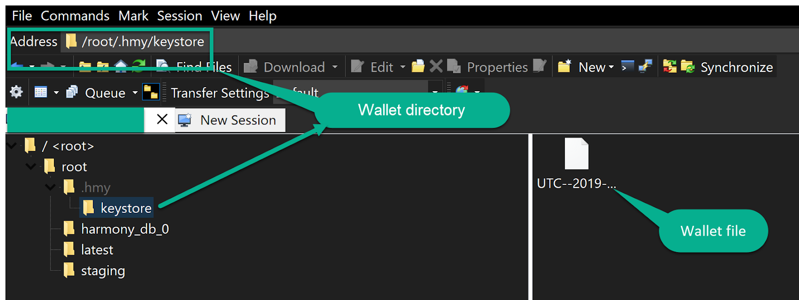

# Upgrading your Disk Space on Vultr

If you run a validator on Vultr the **current best options** are to either upgrade your instance to 256 GB NVMe or to change the VPS cloud provider.

Vultr offers block storage but currently only for New Jersey instances and tests made with **fio** tool showed poor IOPS performance for the block storage. Therefore block storage on Vultr is currently **not recommended.**


Once you created your new instance like you are usually doing it on Vultr, **the fastest option with minimal downtime is to use the DB snapshot for fast state sync**. There is also the option to create a snapshot on Vultr but again is **not recommended** as **the** **overall downtime will be higher** than the method presented below. When you create a snapshot is recommended to stop active programs and reading/write processes, especially DB related in order to ensure data consistency. This means you will have to stop your validator and create the snapshot. Experiments showed that the snapshot will take longer than 30 Minutes.

## **Change server for your validator with minimal downtime**

The procedure for preparing your server to be validator with minimal downtime is described below. The advantage of this one is that your existing node.sh instance continues to validate and generate rewards while you are doing all the preparations to move to a new server for your validator.

### **Validator key setup**

**Wallet key file** - put your wallet file on the new server in the same folder is placed on the existing server: ~_&lt;your-username&gt;/.hmy/keystore_



**BLS key file** - put your BLS key file on the new server under your user: ~_&lt;your-username&gt;_


### **Download the latest node.sh**

```text
curl -LO https://harmony.one/node.sh
chmod a+x node.sh
./node.sh -h
```

### **Download and extract DB snapshot**

Use node.sh to download and extract DB snapshot for DB 0 and if necessary DB x, where x can be 1, 2 or 3. So there are two cases:  
1\) If your validator is on shard 0 then you need to **download and extract** **only DB 0**.  
2\) If your validator is for example on shard 2, then you need to **download and extract DB 0 and DB 2;**

**Note:** -i option in node.sh is used to specify the shard number. You may choose different shard number, eg. 0, 1, 2, 3, if you need to quickly recover nodes for a different shard. Again, every validator needs to sync both beacon chain \(shard0\) and in case the validator is on another shard different than beacon chain, then also their own shard \(shard1, 2, 3\).

```text
# sync beacon chain
./node.sh -i 0 -b

# sync your own shard, replace X with your shard number.
# This is needed for new node.
./node.sh -i X -b
```


Press "y" to download and extract the harmony\_db\_0/ directory into the db/ directory.

**Note:** 1187117 in the suffix of the filename \(harmony\_db\_0-1187117.tar\) indicates the block height of this tarball file. We may upload newer version of the tarball with higher block height every week. Always choose the latest tarball to catch up with the latest blockchain state faster.

```text
cd
sudo mv -f db/harmony_db_0 .

#run also the command below if your node is on shard 1, 2 or 3 and replace x with your shard id
sudo mv -f db/harmony_db_x .

#at the end remove the download db folder to gain space
rm -rf db
```

### Download the latest wallet

```text
curl -LO https://harmony.one/wallet.sh
chmod a+x wallet.sh
./wallet.sh -d
./wallet.sh list
```


**Very important:** Theoretically you could now start the node. However this could lead to double-signing as you already have a node instance running on your old/existing validator and once EPoS will be active your validator will get slashed. Therefore it is important to understand this mechanism and be prepared for the future.


### Stop your old node.sh instance

As a conclusion you will have to **first terminate your existing node instance on the old/existing server** and then **start a new node instance on the new created server**. For this you have to login into your old/existing server, then use the command _**tmux a**_ to login into your tmux session. Here **press Ctrl+C** to stop the node and then type \_**exit** t\_o close the tmux session.

With the commands below you make sure your node instance on the old/existing server will be stopped.

```text
sudo pkill harmony
sudo pkill node.sh
```

In order to check that no harmony process is running on the system, you can run the following command to expect nothing returned.

```text
pgrep harmony
```

### Create a new node.sh instance on your new server

Once this is done, start a new node instance in tmux on your new created server.

```text
sudo yum install -y tmux                       //installs tmux
tmux new-session -s node                       //creates new tmux session named "node"
sudo ./node.sh
```

Press **Ctrl+b then hit "d"** to detach from tmux

Outside your tmux session you can check to see your shard is incrementing. **Note:** replace the _**x**_ in `blockShard.:X` with the shard your validator is on. This means _**x**_ can be 0, 1, 2 or 3.

```text
tac latest/zerolog*.log | grep -m 1 blockShard.:x | grep -oE blockNumber.:[0-9]+
```

Also you can check your wallet balances using:

```text
./wallet.sh balances
```

After your validator signs blocks again and earns rewards you can take the necessary action to stop your old server. In case you are running on a VPS in cloud make sure to destroy that instance because many providers will charge you even if you stop your instance.

