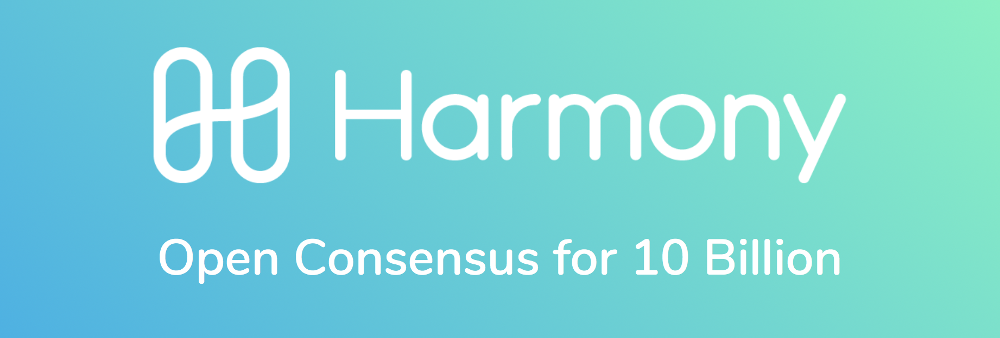

# Future Work

## Availability

Harmony’s architecture centers around the problem of **data availability**. The key questions are:

1. How fast can the network send data to update states?
2. How small can the updates be encoded to minimize bandwidth?
3. How final can transactions be guaranteed by a subset of the network?

**Our insight is using fraud proofs and erasure coding to guarantee the efficiency and the security of transactions across shards.**

Fraud proofs, with a long history in Bitcoin and Ethereum, are used to alert about invalid blocks to all nodes, including clients across shards or clients without the full states. Erasure encoding, also used in Information Dispersion Algorithm \(IDA\) and RaptorQ multicast protocol, makes optimal tradeoff between liveness and redundancy against attacks. You can read more about our experiments that have implemented IDA in our core protocol here\[Insert Link of medium blog on IDA\].

## Research Ideas

We are studying the tradeoffs of Proof-of-Stake. In particular, using checkpoints as in Capser FFG versus instant finality with BFT requires some deeper comparison. Mining incentives and storage rents are the main cryptoeconomics issues for Harmony \(or any next-generation base protocols\) to design. Also, without a PoW base layer, we are exploring the resilience of PoS against nothing-at-stake and long-range attacks.

Some research advances today help privacy and scaling computation, but seemingly not transaction performance for current applications. For example, separating computation from verification and specializing virtual machines for O\(log n\) verification are groundbreaking results. However, few applications are compute-bound or verification-bound. Networks, in terms of making gigabytes of data available daily to many thousands of nodes, are the bottleneck. There are also well-known techniques that awaits good engineering: WebAssembly backends, language designs with OCaml compilers, and HIPv2 + QUIC.

Our long-term goals include using Coq to formally verify our consensus algorithm. We will also investigate many promising results from cryptography research, including stateless clients and proof systems for generalized domains.

## Cross-shard transactions

Cross-shard communication is a key component of any sharding-based blockchains. Cross-shard capability breaks the barrier between shards and extend the utility of a single shard beyond itself. Typically, there are three categories of cross-shard communication:

1. Beacon chain-driven: Some blockchains rely on a beacon chain to achieve transactions across shards.
2. Client-driven: In a client-driven cross-shard transaction, the messages are collected and sent across different shards by the client. This adds an extra burden on the client and is not desirable for adhoc light clients.
3. Shard-driven: In this method, the messages are directly sent by the nodes in one shard to the nodes in another shard, without any external help.

Harmony adopts the shard-driven approach for its simplicity and the absence of burden on clients. We believe the benefits of shard-driven communication outweights its drawback. The cost on overall network for shard-driven communication is significant because every cross-shard message is a network-level broadcast which incurs a _O\(N\)_ network cost. To solve this problem, Harmony use Kademlia routing protocol to reduce the communication complexity to _O\(logN\)_. In addition, the data being communicated is encoded with erasure code to ensure the security of cross-shard communication. More details on this in the Networking section.

For cross-shard smart contract, we are actively doing research on causal consistency between shards in the cross-shard smart contract execution. We have some preliminary result published in our [research forum](https://talk.harmony.one/t/ideas-towards-a-scalable-smart-contract-architecture-for-a-sharded-blockchain/83).

