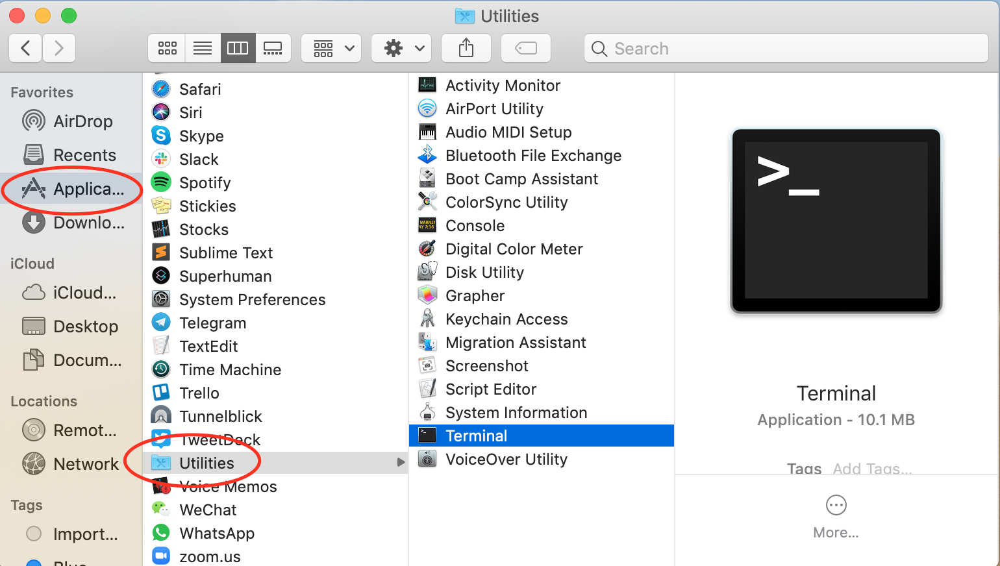
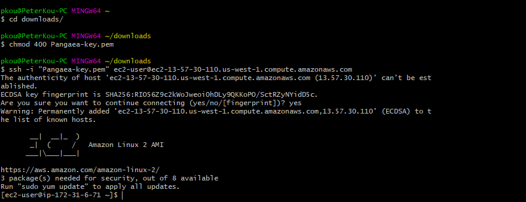

# Connecting to your AWS Instance



**1.** Open a Terminal window on your computer.

 **For Mac:** If you can’t find Terminal, use spotlight to search for it. Or go to your "Applications' folder, and it should be inside of “Utilities”.



**For Windows:** Download Putty or Git Bash to allow your computer to SSH into the AWS instance. For instructions on connecting to an EC2 instance using Putty follow [these instructions](https://docs.aws.amazon.com/quickstarts/latest/vmlaunch/step-2-connect-to-instance.htm) from Amazon.

**2.** Once Terminal is open, use the `cd` command to change your directory to where the key pair file \(Pangaea-key.pem\) that you generated is. Hint it may be in your “Downloads” folder.


**3.** Enter the command `chmod 400 Pangaea-key.pem`. This command makes your key not publicly viewable.

**Note:** On Mac, your pem file may have been changed to a .txt file so the correct command on Mac would be: `chmod 400 Pangaea-key.pem.txt`


**4.** Go back to your AWS window where you are viewing your instances. Select your new "Pangaea-key" instance and click “Connect” on the top bar.

**5.** In the pop-up window, under the “Example:” header, copy the sample command to connect to your ec2 instance. The command will look something like:

```text
ssh -i "pangaea-key.pem" ec2-user@ec2-13-250-30-215.ap-southeast-1.compute.amazonaws.com
```

Now connect to your instance by running the sample command you copied from the “Connect” page in your terminal window.


It may ask you whether or not you want to continue connecting. Type in “yes” and hit enter.



Congratulations! You should be logged into your new AWS instance!

 **6.** Run the following command to make sure your instance is properly updated:

```text
sudo yum update
```

When prompted whether or not you want to download packages, enter "y" for yes.

**7.** Now install the following packages that will be needed to run Harmony by typing:

```text
sudo yum install tmux
```

You will be asked to confirm if you would like to download and install these packages. Just press Y to confirm.

