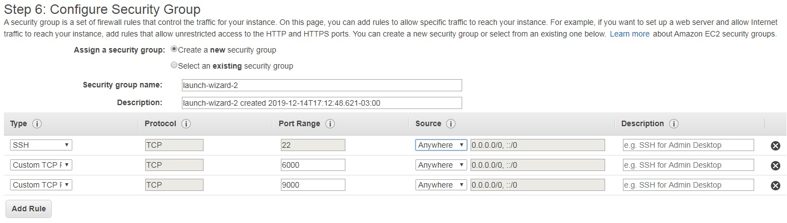
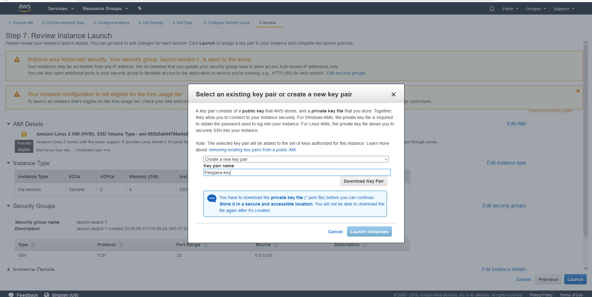

# AWS

**1.** If you don’t already have an AWS account, register one at[ https://aws.amazon.com](https://aws.amazon.com/).

**2.** Once you have set up and logged into your AWS account, click on the top left bar “Services -&gt; Compute -&gt; EC2".

**3.** Click on the blue button “Launch Instance".

**4.** Select “Amazon Linux 2 AMI \(HVM\), SSD Volume Type”.

**5.** Choose instance type “t3.small”.

**6.** Click “Next: Configure Instance Details” at the bottom right of the page.

**7.** Don't change anything on this page, just click “Next: Add Storage” at the bottom right of the page.

**8.** Change the “Size \(GiB\)” category to 30

**9.** Click “Next: Add Tags".

**10.** Click "Add Tag." Then, in the “Key” input box put “Name” in “Value” put “Pangaea-key”.

**11.** Click “Next: Configure Security Group.”

**12.** On the default SSH with port 22, change the “Source” option to “Anywhere.”

**13.** Click "Add Rule". Under "Type" select "Custom TCP Rule", under "Port Range" put "6000" and under "Source" select "Anywhere".

**14.** Click "Add Rule" again. This time, under "Type" select "Custom TCP Rule", under "Port Range" put "9000" and under "Source" select "Anywhere".

**15.** Click “Review and Launch” and then click "Launch". \(Note: Ignore warnings such as “your security group is open to the world” or “your instance configuration is not eligible for free tier.”\)

**17.** In the pop-up window you will need to create a new key pair. Select “Create a new key pair” and then enter a name that you like, for example “Pangaea-key”

**18.** Click “Download Key Pair” and save the key file somewhere you'll remember.

**19.** Click “Launch Instances”.

**20.** Click “View Instances” at the bottom right. Your new instance should be initializing. Wait a few moments for it to get started.

**21.** Congratulations your instance is up and running! Now it's time to connect to your instance and 

Keep this window open for future reference.

