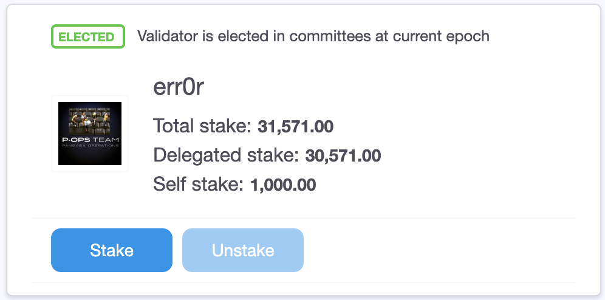

# Adding A Validator Logo

### Uploading A Custom Logo

1. Fork this github repo: [https://github.com/harmony-one/validator-logos](https://github.com/harmony-one/validator-logos)

2. Upload a 256x256px or 512x512px png image of your choice to your validator-logos fork.

3. Create a pull request for your changes. A Harmony team member will review the image & approve it.

