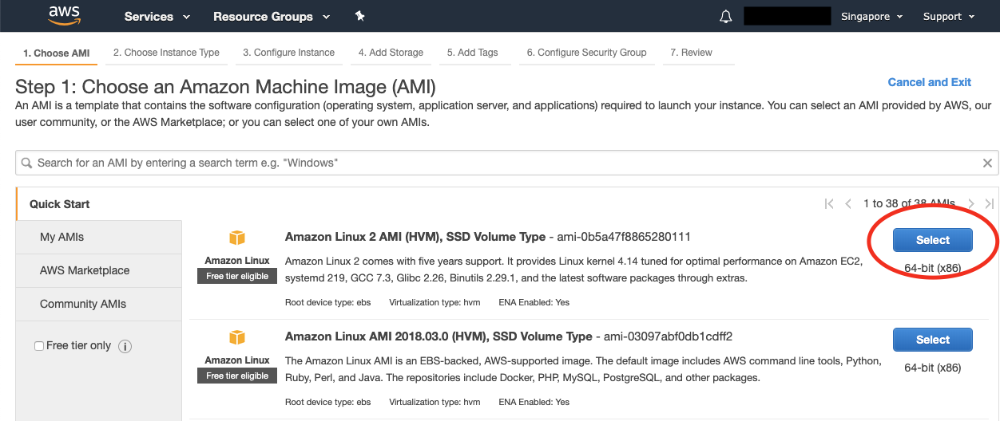
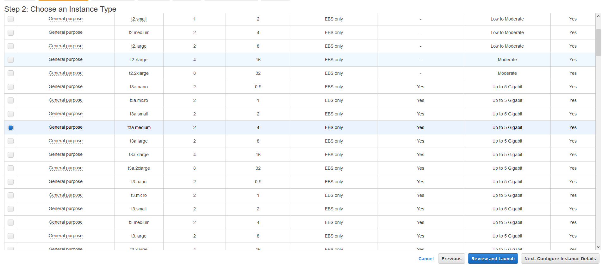

# AWS

To launch your AWS instance, we will go through 3 steps.

**Step 1: Launching your AWS Instance**

* Registering AWS and choosing the correct instance.

**Step 2: Connecting to your AWS Instance**

* Connecting to your AWS instance

## **Step 1: Launching your AWS Instance**

**1.** If you don’t already have an AWS account, register one at[ https://aws.amazon.com](https://aws.amazon.com/).

**2.** Once you have set up and logged into your AWS account, click on the top left bar “Services -&gt; Compute -&gt; EC2".


**3.** Click on the blue button “Launch Instance".


**4.** Select “Amazon Linux 2 AMI \(HVM\), SSD Volume Type”.



**5.** Choose instance type “t3.small.” \(In this example I have chosen t3a.medium. Later on the benchmark shows that t3.small performs just as well for a much lower price.\)



**6.** Click “Next: Configure Instance Details” at the bottom right of the page.

**7.** Don't change anything on this page, just click “Next: Add Storage” at the bottom right of the page.

**8.** Change the “Size \(GiB\)” category to 30


**9.** Click “Next: Add Tags".

**10.** Click "Add Tag." Then, in the “Key” input box put “Name” in “Value” put “Pangaea-key”.


**11.** Click “Next: Configure Security Group.”

**12.** On the default SSH with port 22, change the “Source” option to “Anywhere.”

**13.** Click "Add Rule". Under "Type" select "Custom TCP Rule", under "Port Range" put "6000" and under "Source" select "Anywhere".

**14.** Click "Add Rule" again. This time, under "Type" select "Custom TCP Rule", under "Port Range" put "9000" and under "Source" select "Anywhere".


**15.** Click “Review and Launch” and then click "Launch". \(Note: Ignore warnings such as “your security group is open to the world” or “your instance configuration is not eligible for free tier.”\)

**17.** In the pop-up window you will need to create a new key pair. Select “Create a new key pair” and then enter a name that you like, for example “Pangaea-key”


**18.** Click “Download Key Pair” and save the key file somewhere you'll remember.

**19.** Click “Launch Instances”.

**20.** Click “View Instances” at the bottom right. Your new instance should be initializing. Wait a few moments for it to get started.

**21.** Congratulations your instance is up and running! Now it's time to connect to your instance and 


Keep this window open for future reference.

## **Step 2: Connecting to your AWS Instance and copying keys**



**1.** Open a Terminal window on your computer.

**Note:** If you can’t find Terminal, search for it in your applications folder. If you are on a mac, they often hide Terminal inside of the “Utilities” folder within Applications.


**For Windows:** Download Putty or Git Bash to allow your computer to SSH into the AWS instance. For instructions on connecting to an EC2 instance using Putty use the following resource from Amazon:[ https://docs.aws.amazon.com/quickstarts/latest/vmlaunch/step-2-connect-to-instance.html](https://docs.aws.amazon.com/quickstarts/latest/vmlaunch/step-2-connect-to-instance.html)

**2.** Once Terminal is open, use the `cd` command to change your directory to where the key pair file \(Pangaea-key.pem\) that you generated is. Hint it may be in your “Downloads” folder.


**3.** Enter the command `chmod 400 Pangaea-key.pem` \(this makes your key not publicly viewable\).

**Note:** On Mac, your pem file may have been changed to a .txt file so the correct command on Mac would be: `chmod 400 Pangaea-key.pem.txt`


**4.** Go back to your AWS window where you are viewing your instances. Select your new "Pangaea-key" instance and click “Connect” on the top bar.

**5.** In the pop-up window, under the “Example:” header, copy the sample command to connect to your ec2 instance. The command will look something like:

```text
ssh -i "pangaea-key.pem" ec2-user@ec2-13-250-30-215.ap-southeast-1.compute.amazonaws.com
```

Now connect to your instance by running the sample command you copied from the “Connect” page in your terminal window.


It may ask you whether or not you want to continue connecting. Type in “yes” and hit enter.


Congratulations! You should be logged into your new AWS instance!

 **6.** Run the following command to make sure your instance is properly updated:

```text
sudo yum update
```

When prompted whether or not you want to download packages, enter "y" for yes.

Now install the following packages that will be needed to run Harmony by typing:

```text
apt-get install dnsutils
apt-get install tmux
```

You will be asked to confirm if you would like to download and install these packages. Just press Y to confirm.

