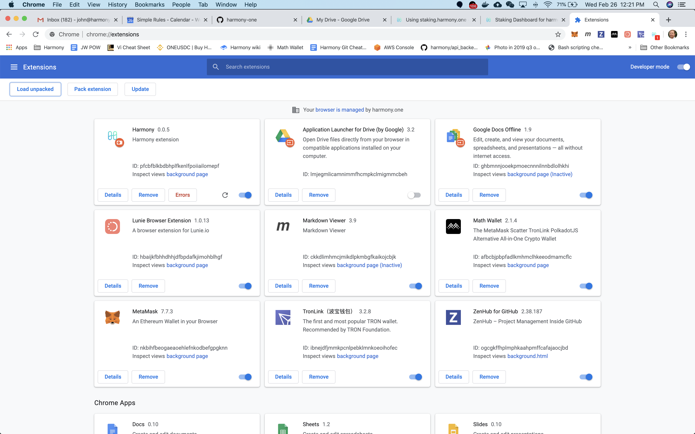
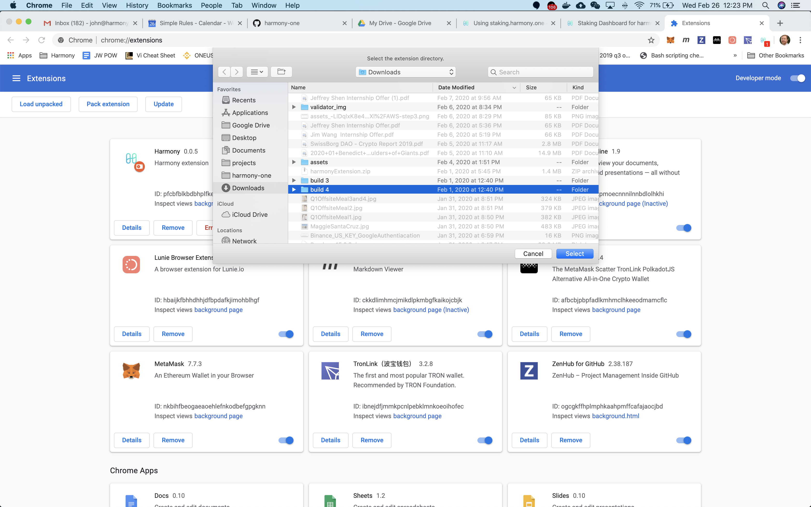

# Using staking.harmony.one

### Overview

Harmony staking explorer is s[taking.harmony.one ](https://staking.harmony.one/)and harmony has a chrome extension which is used for signing private keys and signing transactions. This guide walks through installing the chrome extension and importing your private keys so that you can log in, view validators and delegate

#### Downloading and installing harmonyExtension 

Download this zip file 



Unzip the file 

In google chrome go to [chrome://extensions/](chrome://extensions/) and turn developer mode on \(the button on the right\)

Select Load Unpacked a pop up file selector will appear select the unzipped folder 

 

### Import your private key into the Harmony Extension

#### Retrieve your private key for your account

* Log into your validator - this is your AWS instance which you deployed your validator
* Get your account name by using `./hmy keys list`
* Get your private key from your node by running command `./hmy keys export-private-key <<account-name>>` where account name is the account you created and listed above
* Copy your private key

#### Import your private key into the Harmony Extension

* Open in the 

#### Log in to staking.harmony.one

#### Set your network

#### View validators

#### Delegate to a validator

